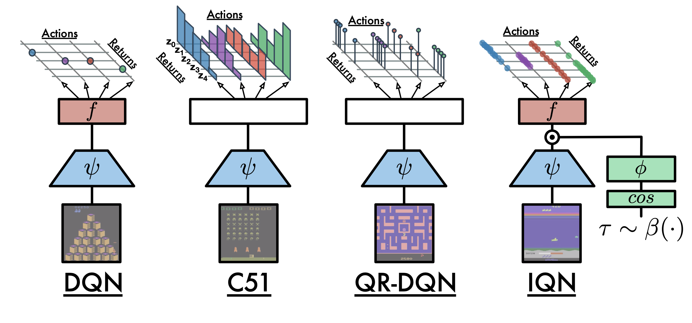

  <br>

<p align="center">
  
</p>

<h2 align=center>Distributional RL in TensorFlow2</h2>

[dist-rl-tf2](github.com/marload/dist-rl-tf2) is a repository that implements a variety of popular Distribution Reinforcement Learning Algorithms using [TensorFlow2](tensorflow.org). Distributional RL is an algorithm suitable for stochastic environments. If you want to study the Distribution RL, this repository will be the best choice. The dist-rl-tf2 includes three Distributional RL algorithms published by [DeepMind](deepmind.com), a leading AI research institute.

## Algorithms

- [C51](#c51)
- [QRDQN](#qrdqn)
- [IQN](#iqn)
<hr>
<p align="center">
  
</p>

<a name='c51'></a>
### C51
**Paper** [A Distributional Perspective on Reinforcement Learning](https://arxiv.org/abs/1707.06887)<br>
**Author** Marc G. Bellemare, Will Dabney, Rémi Munos<br>
**Method** OFF-Policy / Temporal-Diffrence / Model-Free<br>
**Action** Discrete only<br>

#### Core of Idea
```python
# idea01. The output of the Q Network is a Distribution Vector, not a Scalar Value.
def create_model(self):
    input_state = Input((self.state_dim,))
    h1 = Dense(64, activation='relu')(input_state)
    h2 = Dense(64, activation='relu')(h1)
    outputs = []
    for _ in range(self.action_dim):
        outputs.append(Dense(self.atoms, activation='softmax')(h2))
    return tf.keras.Model(input_state, outputs)
```

#### Getting Start
```bash
# Discrete Action Space C51
$ python C51/C51.py
```
<hr>
<a name='qrdqn'></a>
### QRDQN
**Paper** [Distributional Reinforcement Learning with Quantile Regression](https://arxiv.org/abs/1710.10044)<br>
**Author** Will Dabney, Mark Rowland, Marc G. Bellemare, Rémi Munos<br>
**Method** OFF-Policy / Temporal-Diffrence / Model-Free<br>
**Action** Discrete only<br>

#### Core of Idea
```python
# idea01. The output of the Q Network is Quantile Region, not the Distribution Vector.
def create_model(self):
    return tf.keras.Sequential([
        Input([self.state_dim, ]),
        Dense(64, activation='relu'),
        Dense(64, activation='relu'),
        Dense(self.action_dim * self.atoms, activation='linear'),
        Reshape([self.action_dim, self.atoms])
    ])

# idea02. Use Quantile Huber Loss instead of CategoryCrossEntropy Loss.
def quantile_huber_loss(self, target, pred, actions):
    pred = tf.reduce_sum(pred * tf.expand_dims(actions, -1), axis=1)
    pred_tile = tf.tile(tf.expand_dims(pred, axis=2), [1, 1, self.atoms])
    target_tile = tf.tile(tf.expand_dims(
        target, axis=1), [1, self.atoms, 1])
    huber_loss = self.huber_loss(target_tile, pred_tile)
    tau = tf.reshape(np.array(self.tau), [1, self.atoms])
    inv_tau = 1.0 - tau
    tau = tf.tile(tf.expand_dims(tau, axis=1), [1, self.atoms, 1])
    inv_tau = tf.tile(tf.expand_dims(inv_tau, axis=1), [1, self.atoms, 1])
    error_loss = tf.math.subtract(target_tile, pred_tile)
    loss = tf.where(tf.less(error_loss, 0.0), inv_tau *
                    huber_loss, tau * huber_loss)
    loss = tf.reduce_mean(tf.reduce_sum(
        tf.reduce_mean(loss, axis=2), axis=1))
    return loss
```

#### Getting Start
```bash
# Discrete Action Space QRDQN
$ python QR-DQN/QR-DQN.py
```
<hr>
<a name='iqn'></a>
### IQN
**Paper** [Implicit Quantile Networks for Distributional Reinforcement Learning](https://arxiv.org/abs/1806.06923)<br>
**Author** Will Dabney, Georg Ostrovski, David Silver, Rémi Munos<br>
**Method** OFF-Policy / Temporal-Diffrence / Model-Free<br>
**Action** Discrete only<br>

#### Core of Idea
```python
# idea01. Use the quantile embedding network.
def call(self, state):
    x = self.feature_extraction(state)
    feature_dim = x.shape[1]
    tau = np.random.rand(self.atoms, 1)
    pi_mtx = tf.constant(np.expand_dims(
        np.pi * np.arange(0, self.quantile_dim), axis=0))
    cos_tau = tf.cos(tf.matmul(tau, pi_mtx))
    phi = self.relu(self.phi(cos_tau) +
                    tf.expand_dims(self.phi_bias, axis=0))
    phi = tf.expand_dims(phi, axis=0)
    x = tf.reshape(x, (-1, feature_dim))
    x = tf.expand_dims(x, 1)
    x = x * phi
    x = self.fc(x)
    x = self.fc_q(x)
    q = tf.transpose(x, [0, 2, 1])
    return q, tau

# idea02. Use the random sampled value instead of the specified value of the tau.
tau = np.random.rand(self.atoms, 1)
```

#### Getting Start
```bash
# Discrete Action Space IQN
$ python IQN/IQN.py
```
<hr>

## Reference
- https://reinforcement-learning-kr.github.io/2018/09/27/Distributional_intro/
- https://github.com/reinforcement-learning-kr/distributional_rl
- https://github.com/floringogianu/categorical-dqn
- https://github.com/ku2482/fqf-iqn-qrdqn.pytorch
- https://github.com/xlnwel/model-free-algorithms
- https://github.com/valeoai/rainbow-iqn-apex